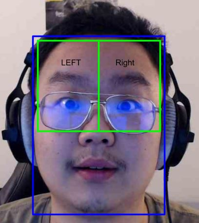

# BigTeacherIsWatching
HackInPlace Feb2021 Project by Chuwei (Chewy) Guo, Aaron Chen, Zijie (Jerry) Wu, Khaing Su Yin (Alice)

<h1> Objective </h1>

    This project was done for the Hack in Place Hackathon. There were four challenges available: Home, Economy, Health, and Education.

<h2> Description of the four challenges: </h2>
<h3> Home </h3>

    2020 saw record-breaking wildfires, heatwaves, hurricanes, and floods. The increasing severity of natural disasters is just one facet through which climate chnage is affecting our one home - planet earth. 

    Team Challenge: Create innovative solutions that help individuals reduce their carbon footprint, and become more resilient to changes in the environment. 

<h3> Economy </h3>

    Extended shelter-in-place restrictions, necessitated by the pandemic, have led to significant financial losses for most small and medium-sized businesses, forcing many to permanently close down altogether. 

    Team Challenge: Design resourceful methods to help local businesses connect and engage with consumers in the COVID era. 

<h3> Health </h3>

    Even with the ongoing vaccine rollout, the COVID pandemic is still a huge health risk both to us and our communities.

    Team Challenge: Find creative ways for people to stay resilient and healthy both mentally and physically while sheltering in place.

<h3> Education </h3>

    Systems of education are always evolving, but last year we saw drastic changes in how we learn. While we’ve made good progress in transitioning to online learning, there still remains much to be done in this space.

    Team Challenge: Find ways that we can improve the virtual learning experience for learners and instructors

<h3> Team Choice </h3>

 
    Our team was originally stuck between the theme of Education and Home. Specifically, the issues of climate change and carbon footprint tracking from Home and the anti-cheating mechanism for Education. We ultimately elected to pursue the theme of Education. During the COVID pandemic and the transition to online learning, there has been an increase in academic dishonesty accusations and cheating. But, this already has a solution technologically with lockdown browsers and proctoring during live exams. However, the biggest issue of all was the difficulty in transition from a physical classroom experience to an fully online classroom experience.

    Many professors noted that their students did worse during the online setting. In addition, many teachers were not able to fully gauge their student's level of understanding of the material. This can perhaps be due to a lack of attention during classtime.

    To address the above possibility and issue, we decided to create a rather dystopian solution. Our prototype can serve as an additional feature on Zoom, where student's eyes will be tracked. If they look away, it will be flagged and perhaps, the professor can come back to review these moments. This can give the professor a sense of when a student lost focus and what can potentially be reviewed in the coming days.

<h3> Pupil Tracking </h3>

Hello everyone! Today, we will be giving a short demo on our software, 1984, which serves as a solution for professors to track student’s attention through OpenCV eye tracking.

We are basically going to use detection processes, which are just machine-learning-based algorithms that classify between object and non-object images. 
Our software will use existing face_cascade and eye_cascade classifiers to identify student faces and eyes on video feeds, which are just N pictures (frames) per second. When we detect faces, the faces object is an array with potential sub-arrays consisting of four numbers: X, Y, width, and height of the detected face.

We will detect eyes the same way. But, we will be working with the face frame instead of the entire picture now. The eyes object is just like faces object — it contains X, Y, width and height of the eyes’ frames. When a face is detected, the algorithm searches for eyes on the top half of the face region of interest. This reduces chances of mismatching the mouth as an eye. However it can be reversed if we receive complaints about discriminating against people with enormous foreheads.

After eyes are located in the top half of the face, The algorithm divides the face into left and right sections to separate the right and left eye. (Left and right is subjective here).

Once the eyes are located, the pupil’s location will be located with the use of blob-detection algorithms. We know that the pupil is always the darkest part of the eye so we’ll set a threshold to filter out regions of non-interest. We will then be left with only the pupils, which are our keypoints. We collect the coordinates of these keypoints, the position of the pupil, and average it out over 30 tick intervals and determine if the student is currently on task or not.

